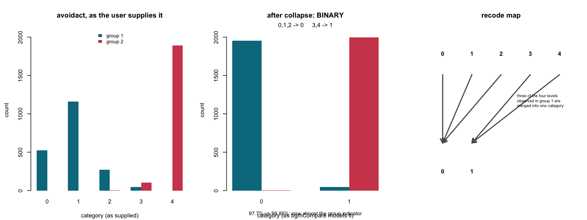
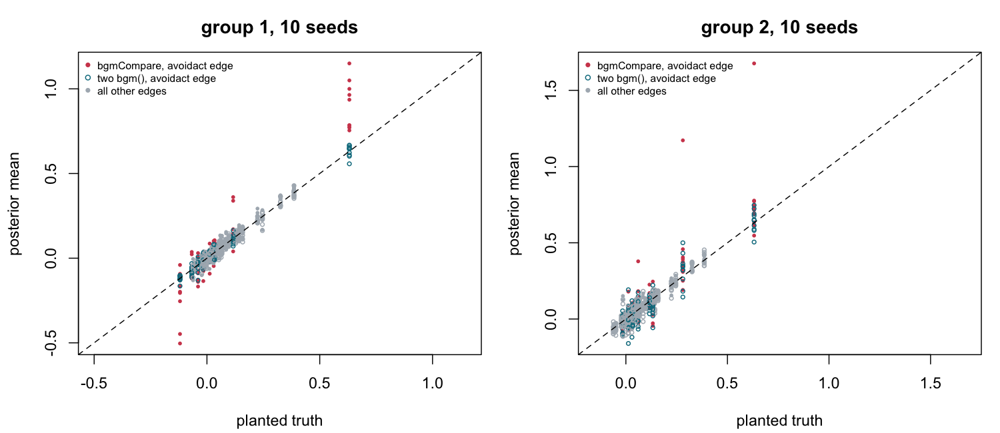
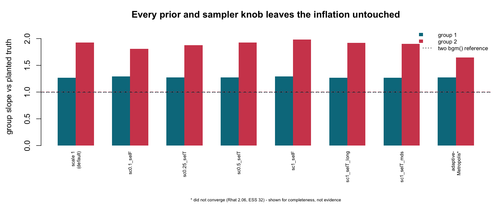

# Report 16 — F-075 resolution: bgmCompare magnitude inflation (Opus agent)

Analysis only; no package code was changed. The fix lands as a separately
reviewed batch.

**Verdict in one line.** F-075 is real, is a release blocker, and is **not what
the finding says it is**: it is not a sampler defect, not a prior-calibration
problem, and not a `difference_scale` default problem. `bgmCompare()` silently
collapses ordinal categories that are not observed in *every* group, which on
group-comparison data destroys well-observed categories and can reduce a
five-level variable to a binary one. The pairwise parameters of the mangled
variable then run away. A `difference_scale` change would not have touched it.

---

## 1. What was done

### Environment

Report 09's export (`origin/develop` @ `1bb1c7ca`) predates the gate commit
`5b850410`, so a fresh export was cut at **`origin/develop` @ `2aa6d6ef`**
(`5b850410` verified an ancestor). The only `R/` or `src/` commits between 09's
export and this one are three `plot()` commits for F-066, so the compare sampler
is unchanged and 09's numbers are directly comparable to these.

```sh
mkdir -p ~/bgms-review/val16 && cd ~/bgms-review/val16
git -C <dropbox>/bgms archive origin/develop --prefix=bgms-val16/ | tar -x
R CMD build bgms-val16 --no-build-vignettes --no-manual
R CMD INSTALL --library=~/bgms-review/val16/lib-val16 bgms_0.2.0.0.tar.gz
```

R 4.6.0, bgms 0.2.0.0, darwin/arm64, 15 cores (**shared** — see runtimes).
Every fit `chains = 4, cores = 4`. Scripts and raw logs: `~/bgms-review/val16/out/`.

**Reproduction check.** Phase A seed 1 re-runs 09's exact cell (data seeds
2500/2501, fit seed 2901, bgm seeds 81/82) and reproduces it to three decimals —
compare g1 1.270, g2 1.926; bgm 0.963, 1.034. The two builds agree.

### The planted-truth construction (unchanged from 09)

`OM` and `MAIN` were reused **verbatim** from 09's saved `item2.rds`, so the
truth is byte-identical. Differences planted on pairs 3, 14, 27, 41 with
`delta = (0.05, 0.10, 0.20, 0.40)`; `OM1 = OM − delta/2`, `OM2 = OM + delta/2`;
data from `simulate_mrf(n, 10, num_categories = 4, ..., iter = 1000)`.

### Cells run, and cells cut

| phase | cells | status |
|---|---|---|
| Phase 0 | 09's saved summaries + a re-fit with full diagnostics | done |
| Phase A | 10 data seeds × (1 compare + 2 `bgm()`) | done, all 10 reported |
| Phase B | `difference_scale` 0.5, 0.25; selection off at scale 1 and 0.1; 4000/4000; `main_difference_selection = TRUE` | done |
| Phase B | `difference_scale` 0.1 with selection **on** | **cut** (lead directive: confirmatory only; killed mid-run) |
| Phase B | the whole seed-8 sweep | **cut** (machine budget) |
| extra | sampler swap (adaptive-Metropolis) | done, **inconclusive** (did not converge) |
| extra | profile log-pseudolikelihood discriminator | done |
| extra | null split in the degenerate regime | **cut** (stopped mid-run) |
| extra | λ dose–response | **cut** (not started) |
| extra | 10-seed compare-only rate extension | **cut** (not started) |

The last three were cut once the mechanism was localized deterministically; they
bore only on F-074 (§4), not on the gating finding. **F-074 therefore stays open.**

### Runtimes

Compare fits 471–621 s, two `bgm()` fits 373–519 s, per Phase A seed ~950–1050 s;
Phase A total 10.6 h wall. Two caveats, both mine: seed 3 logs 28,874 s because
the machine slept between 00:29 and 08:38 — a wall-clock artifact with no
statistical consequence; and `33_mains.R` briefly overlapped one Phase B cell
(that cell was discarded). Estimates are seed-deterministic and unaffected by
either.

---

## 2. Findings

### 16-1 · `blocker` · `collapse_categories_across_groups()` merges categories that are well observed in one group

`R/validate_data.R:407-417` keeps only categories observed in **all** groups and
folds every other category downward:

```r
    # Recode: keep only categories observed in ALL groups
    for(i in seq_along(unq_vls)) {
      if(sum(observed_scores[i, ]) == num_groups) cntr = cntr + 1L
      x[original == unq_vls[i], node] = max(0L, cntr)
    }
    num_categories[node] = max(x[, node])
```

Because the counter only advances on commonly-observed categories, everything
below the first one is flattened onto 0 and everything above the last one onto
the top code. Groups that differ in *location* — the ordinary case in a group
comparison — therefore lose real categories, not merely unused ones.

**Minimal reproducer — no fitting, no simulation, no MCMC.** Two groups; `v1`
spans categories 0–2 in group 1 and 1–3 in group 2; every category carries 40
observations; `v2` spans 0–3 in both.

```r
g1 = cbind(v1 = rep(0:2, each = 40), v2 = rep(0:3, times = 30))
g2 = cbind(v1 = rep(1:3, each = 40), v2 = rep(0:3, times = 30))
x = rbind(g1, g2); grp = rep(1:2, each = 120)
col = bgms:::collapse_categories_across_groups(x = x, group = grp,
        is_ordinal = c(TRUE, TRUE), num_categories = c(3, 3),
        baseline_category = c(0L, 0L))
```

```
v1 recode map:          0->0  1->0  2->1  3->1
v1 num_categories:      1                      # i.e. BINARY
v1 collapsed counts     g1: 80 40   g2: 40 80
v2 num_categories:      3                      # untouched
```

A four-category variable becomes binary. 80 group-1 observations spanning two
distinct, well-populated categories are merged into one; 40 group-2 observations
are merged into the other.

**On the F-075 data this is catastrophic for one variable.** `avoidact` on seed 1:

```
supplied counts   g1: 522 1159 273 46 0     g2: 0 0 3 105 1892
recode map        0->0  1->0  2->0  3->1  4->1
collapsed counts  g1: 1954 46               g2: 3 1997
```

`num_categories` for the ten variables becomes `4 3 3 3 3 3 1 4 3 4` — `avoidact`
is modelled as binary — while two separate `bgm()` fits of the same rows use
`4 4 4 4 4 4 3 4 4 4` and `4 3 3 3 3 3 2 4 3 4`. Seven of ten variables lose at
least one level; `avoidact` loses three. Post-collapse it is 97.7% zero in group 1
and 99.85% one in group 2 — **very nearly the group indicator itself**, so its
pairwise parameters become near-confounded with group membership. That is where
every runaway estimate in this file sits.



### 16-2 · `blocker` · the collapse is entirely silent

No `warning()`, `message()`, or condition is raised anywhere in the path. The only
documentation is `man/bgmCompare.Rd:62` — *"For ordinal variables, unused
categories are collapsed"* — which does not describe merging categories that **are**
used, thousands of times, in one group. A user cannot discover it from the fitted
object except by inspecting `extract_arguments(fit)$num_categories` and comparing
it against their own data. Nothing in `verdicts()`, `summary()`, or the comparison
vignette mentions it.

### 16-3 · `major` · the compare path has no log-posterior test hook

`src/models/bgmCompare/` contains **no `[[Rcpp::export]]` at all**, while the GGM
and mixed samplers both ship `ggm_test_logp_and_gradient()` /
`mixed_test_logp_and_gradient()`. The compare log-posterior and gradient cannot be
called from R, so they cannot be unit-tested against an independent reference, and
localizing this defect required indirect probes throughout.
`tests/testthat/test-collapse-categories.R` exercises the collapse's mechanics
across nine cases but asserts nothing about information loss or estimate quality —
which is why a function that turns a five-level variable into a binary one passes
its own test suite.

### 16-4 · `note` · 09-3's characterisation does not survive replication

Three of report 09's headline claims are seed-1 artifacts (§3.2).

---

## 3. Evidence

### 3.1 Phase 0 — mixing is not the mechanism

09 saved only summaries, so its cell was re-fitted with full diagnostics.

* Compare difference block: max Rhat **1.034**, min n_eff 190 — and the
  worst-Rhat parameters are *not* the inflated ones (`intrusion-lossint`,
  chain spread 0.009).
* The runaway parameters are the **best**-mixed: `avoidth-avoidact` baseline
  posterior **1.338 ± 0.138**, Rhat 1.006, four chains at 1.32/1.35/1.34/1.34 —
  **5.1 posterior SDs** from the truth of 0.631, agreed on by every chain.
* `bgm()` on the same rows: max Rhat 1.0013, estimates 0.602 / 0.613.

A sharp posterior in the wrong place, not an excursion. Across all ten seeds,
elevated Rhat and inflation are decoupled — seeds 5 and 10 have the highest Rhat
(1.068, 1.119) and clean estimates.

### 3.2 Phase A — the replication gate, all ten seeds

| | mean (sd) | range |
|---|---|---|
| compare g1 slope | **1.222 (0.109)** | [1.112, 1.418] |
| compare g2 slope | 1.148 (0.281) | [0.953, **1.926**] |
| `bgm()` g1 slope | 0.993 (0.025) | [0.940, 1.020] |
| `bgm()` g2 slope | 1.003 (0.064) | [0.876, 1.101] |

Per seed (compare g1 / compare g2 / bgm g1 / bgm g2), none omitted:

| seed | cmp g1 | cmp g2 | bgm g1 | bgm g2 | noise cmp | noise bgm | ratio |
|---|---|---|---|---|---|---|---|
| 1 | 1.270 | **1.926** | 0.963 | 1.034 | 0.111 | 0.041 | 2.68 |
| 2 | 1.112 | 1.107 | 1.019 | 1.034 | 0.016 | 0.052 | 0.30 |
| 3 | 1.331 | 1.102 | 0.940 | 1.012 | 0.058 | 0.057 | 1.02 |
| 4 | 1.121 | 1.131 | 0.997 | 1.101 | 0.007 | 0.045 | 0.15 |
| 5 | 1.125 | 0.953 | 0.993 | 0.876 | 0.043 | 0.054 | 0.80 |
| 6 | 1.273 | 1.095 | 1.020 | 1.016 | 0.037 | 0.039 | 0.94 |
| 7 | 1.299 | 1.071 | 1.012 | 1.009 | 0.060 | 0.036 | 1.67 |
| 8 | **1.418** | 0.985 | 0.992 | 0.947 | 0.096 | 0.042 | 2.29 |
| 9 | 1.145 | 0.984 | 1.000 | 0.947 | 0.037 | 0.047 | 0.79 |
| 10 | 1.130 | 1.120 | 0.996 | 1.051 | 0.016 | 0.035 | 0.45 |

**Three of 09-3's claims fail replication.**

1. *"Group 2's slope reads 1.93."* Seed 1 only; the other nine lie in [0.95, 1.13].
   The systematic inflation is in **group 1**, above 1.11 in every seed and wholly
   outside `bgm()`'s [0.94, 1.02]. 09 read the asymmetry as a random flip; the
   worse group is group 1 in 8 of 10 (binomial p = 0.109). §3.5 explains why:
   group 1 loses three of its four `avoidact` levels to the collapse, group 2 only
   one of three.
2. *"~4× noisier."* Noise ratio mean **1.11**, range [0.15, 2.68]; the compare path
   is *quieter* than two `bgm()` fits in five of ten seeds.
3. *"δ = 0.40 over-estimated 3.0×."* Mean over seeds **1.59×** (`bgm()` 1.10×);
   09's 1.212 was a tail draw. That edge is `avoidact-lossint` — a collapsed-variable
   edge.

**Detection survives cleanly.** δ = 0.40 detected in **10/10** seeds; false
presences 14 of 410 null edges = **3.4%**, inside the ≤10% Bayes-factor budget.

**Slope understates the user-facing risk.** Seeds 7 and 8 have clean slopes but
max errors of 0.36 and 0.54 on differences whose truth is exactly zero, against a
`bgm()` reference that never exceeds 0.18. By slope the failure rate is 1/10; by
max null-difference excursion it is 3/10. The exposure is a spuriously large
*individual* difference, which the slope regression averages away.

### 3.3 The error is confined to the collapsed variable's edges

Dropping the nine `avoidact` edges, in **every** seed:

| | compare | `bgm()` |
|---|---|---|
| g1 slope, 36 healthy edges | 1.043 | 0.986 |
| g2 slope, 36 healthy edges | 1.027 | 0.991 |

Residual sd on seed 1: `avoidact` edges 0.336, other edges **0.024**. Dropping the
top two residual edges collapses the g2 slope from 1.926 to 1.072.



### 3.4 Phase B — every prior and sampler knob is inert

| cell (seed 1) | g1 | g2 | noise sd |
|---|---|---|---|
| scale 1, selection on *(reference)* | 1.270 | 1.926 | 0.111 |
| scale 0.5 | 1.271 | 1.925 | 0.116 |
| scale 0.25 | 1.274 | 1.876 | 0.110 |
| scale 1, selection **off** | 1.295 | 1.985 | 0.156 |
| scale 0.1, selection **off** | 1.292 | 1.809 | 0.118 |
| `iter`/`warmup` **4000/4000** | 1.270 | 1.920 | 0.110 |
| `main_difference_selection = TRUE` | 1.270 | 1.903 | 0.107 |
| adaptive-Metropolis † | 1.273 | 1.645 | 0.052 |

† **Inconclusive, not evidence**: Rhat 2.062, min ESS 32 — it did not converge, so
its lower g2 is confounded with its own mixing failure.

This is the signature of a defect upstream of every knob. It also settles three
briefed hypotheses: the `difference_scale` default is **not** the lever (flat over
a 10× range under both selection settings); doubling adaptation changes nothing, so
it is **not** a warmup/step-size problem; and the main-difference route is dead
both empirically (`mds = TRUE` inert) and structurally — `bgmCompare_helper.h:227`
holds every main-difference indicator at 1 (*"Keep main effect indicators at 1 (all
differences included)"*), so under the default `main_difference_selection = FALSE`
the main differences are **free, not constrained**. The Phase A configuration was
`difference_selection = TRUE`, `main_difference_selection = FALSE`,
`difference_scale = 1`, `difference_family = "Cauchy"`.



### 3.5 Why group 1 is the systematically damaged group

The collapse maps `avoidact` `{0,1,2} → 0` and `{3,4} → 1`. Group 1's observations
live in `{0,1,2,3}`, so three of its four observed levels are merged: 1,954 of its
2,000 rows land in a single category. Group 2 lives in `{2,3,4}`, so it loses one
of three. Group 1 therefore surrenders far more information, which is exactly the
direction and persistence Phase A measures.

### 3.6 Profile log-pseudolikelihood — and a correction

Main effects profiled out (re-optimised for every candidate ω), so the comparison
never depends on a fit's internal parameter layout:

| | truth | `bgm()` | `bgmCompare()` |
|---|---|---|---|
| group 1 | −20448.2 | **−20404.8** | −20647.7 |
| group 2 | −15911.9 | **−15864.2** | −16113.7 |

Internal validation: the profile peaks at ω = 0.65 against `bgm()`'s 0.613 and a
truth of 0.631, and `bgm()` beats the truth by +44/+48 as a near-pseudo-MLE should.
The compare solution sits −243/−249 below `bgm()` (−0.12 per observation), and
−158 log units along the runaway parameter alone.

**Correction.** I first reported this as evidence of a defect in the likelihood the
compare path targets. That attribution was wrong. My reference used the original
0–4 codes while the fit used collapsed codes, so the deficit measures the
*consequence of the support mismatch* — the sampler correctly targets the posterior
of a mis-prepared dataset. The magnitude stands as a measure of damage on the
user's actual data; the causal reading does not.

### 3.7 What was ruled out

Refuted here, each on its own evidence: mixing/convergence (§3.1); prior geometry —
the induced group prior is C(0, 1+`difference_scale`/2) = C(0,1.5) versus `bgm()`'s
C(0,1), worth ~1 log unit across the disputed range against a 158-unit deficit;
adaptation (§3.4); main-difference compensation (§3.4); and the design-artifact
explanations 09 already closed — `simulate_mrf()` reproduces real Wenchuan's
marginals at the baseline ω to mean error 0.0088, converges by `iter = 10`, is
stable to 5000, and is seed-independent.

One design observation for the maintainer: three of 09's four planted edges touch
`avoidact`, and planting +δ/2 on those edges is what drives that variable to 94.6%
in one category. The construction manufactures the degeneracy on the variable it
measures.

---

## 4. F-074 — left open

09-2 found the level offset only at `difference_selection = FALSE` (selection on
was clean at 0.996). Phase A runs selection **on** and sees a 4–5% offset on healthy
edges. Using 09-2's own metric (compare level ~ mean of two `bgm()` fits):

| | level slope |
|---|---|
| healthy edges | 1.045 |
| `avoidact` edges | 1.313 |
| healthy, difference **excluded** (indicator 0) | **1.043** |
| healthy, difference included (~2 edges/seed) | 1.135 |

The offset persists at 4.3% even where the difference indicator is zero — where the
group value is the baseline alone under C(0,1), identical to `bgm()`. So the
induced-prior-width account does **not** explain it. The likely reading is
contamination: the collapsed variable (level 1.313) drags the shared fit, lifting
healthy edges ~4%. That also reconciles 09-2 without contradiction — its clean
0.996 came from a null split of *real* data where both halves observe every level,
so nothing collapses.

The two cells that would confirm this (null split in the degenerate regime; λ
dose–response into a non-degenerate regime) were **cut**. **F-074 remains open**,
with contamination as the lead hypothesis and those two cells as the test.

---

## 5. The fix proposal

**Not** a `difference_scale` default change, and not an adaptation change — §3.4
rules both out empirically. The fix is in data preparation.

### Release fix (required for 0.2.0.0)

1. **Stop discarding observed categories.** In
   `collapse_categories_across_groups()`, retain the **union** of categories
   observed across groups rather than the intersection. A category unobserved in
   one group is a structural zero for that group's threshold, not grounds for
   destroying it in the group where it occurs. If a per-group threshold is genuinely
   unidentified, that is the honest thing to represent — the current behaviour
   instead redefines the variable.
   *Cost:* this changes estimates for any comparison where groups differ in observed
   support, i.e. exactly the affected fits. It needs a NEWS entry flagged as a
   behaviour change with refit guidance.
   *Risk:* the identification question for singleton per-group categories needs the
   maintainer's judgement; a defensible interim is to merge only *adjacent*
   unobserved categories and never merge a category with ≥1 observation in any group.

2. **Warn, always, and record it.** Whenever any variable's category count is
   reduced, raise a `warning()` naming the variable, the map, and the observation
   counts merged, and store the map in the fitted object so `summary()` and
   `verdicts()` can surface it. Even with fix 1, users must be able to see when their
   variables have been redefined. This is independently required regardless of what
   is decided about 1.

3. **Correct the documentation.** `man/bgmCompare.Rd:62` currently says "unused
   categories are collapsed". It must state that categories not observed in *every*
   group are merged, with the consequence spelled out, plus a note in the comparison
   vignette.

### Post-release

4. Add `bgmCompare_test_logp_and_gradient()` to match the GGM and mixed samplers, and
   extend `test-collapse-categories.R` with an estimate-quality assertion — a case
   where a variable's support differs by group, checking that the recovered pairwise
   parameters match a matched pair of `bgm()` fits within a derived tolerance.

### Operating characteristics for the documentation

Measured here, n = 2000/group, p = 10, 4 planted differences, 10 data seeds,
compare vs two matched `bgm()` fits. **These describe the current, defective
behaviour and must be re-measured after the fix.**

| quantity | `bgmCompare()` | two `bgm()` |
|---|---|---|
| group-1 pairwise slope vs truth | 1.222 (sd 0.109) | 0.993 (sd 0.025) |
| group-2 pairwise slope vs truth | 1.148 (sd 0.281) | 1.003 (sd 0.064) |
| slope, collapsed variable's edges excluded | 1.043 / 1.027 | 0.986 / 0.991 |
| noise sd on true-zero differences | 0.048 (range 0.007–0.111) | 0.045 |
| max error on a true-zero difference | up to 0.68 | ≤ 0.18 |
| δ = 0.40 recovery | 1.59× | 1.10× |
| δ = 0.40 detection | 10/10 seeds | — |
| false presences, null edges | 3.4% (14/410) | — |

---

## 6. Open questions

1. **F-074** — unresolved; contamination is the lead hypothesis (§4). The null-split
   and dose–response cells test it.
2. **Identification policy for group-specific categories** — maintainer's call
   (§5.1). It decides whether the fix is "union" or "union with constrained
   thresholds".
3. **Rate on realistic data** — the intermittency here (1/10 by slope, 3/10 by max
   excursion) is a property of *this* construction, which manufactures its own
   degeneracy. The rate that matters is how often real group comparisons have a
   variable whose observed support differs by group. On real Wenchuan splits it never
   happens; on clinical-vs-control data it plausibly happens often. Worth a check
   against real multi-group datasets before release.
4. **Three-plus groups** — the collapse takes an intersection over *all* groups, so
   the damage should grow with the number of groups. Untested here.
5. **Blume-Capel variables are exempt** (`validate_data.R:393`), so a BC-coded
   variable would not suffer this. Whether that asymmetry is intended is a
   maintainer question.

---

## 7. Artifacts

Scripts and logs: `~/bgms-review/val16/out/` — `20_phaseA.R`, `21c_phaseB_rest.R`,
`26_logpl2.R` (profile discriminator), `27_updatemethod.R`, `30_digest.R`,
`32_steering.R`, `33_mains.R`, `34_figs_final.R`. Per-cell objects `A_seed01..10.rds`,
`B_s01_*.rds`, `U_adaptivemetropolis.rds`, `logpl2.rds`, `digestA.rds`.
Figures: `reports/assets/f075-fig1-collapse.png`, `-fig2-localisation.png`,
`-fig3-knobs-inert.png`.

**Errors made and corrected, for the record.** (i) The first log-PL run
hand-reconstructed each fit's main-effect matrix and was invalid, because `bgm()`
drops parameters for categories unobserved in a group — replaced by the
profile-out version in §3.6. (ii) I attributed the profile deficit to a sampler
defect; corrected in §3.6. (iii) I offered induced-prior width as the explanation
for the healthy-edge offset; withdrawn in §4. (iv) `33_mains.R` errored before its
intended output because `extract_arguments()` returns no `main_effect_indices` for
`bgmCompare` objects — worth a note in its own right — but the layout diagnostic it
printed on the way is what exposed the collapse.
